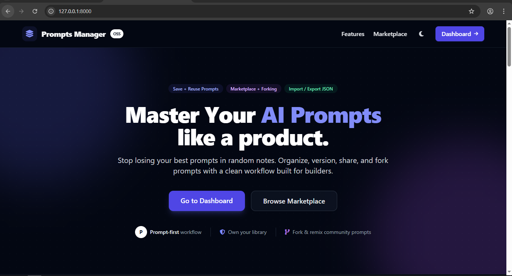
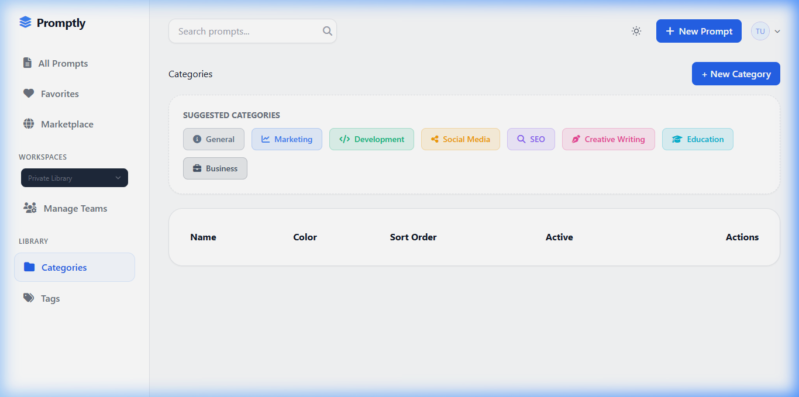
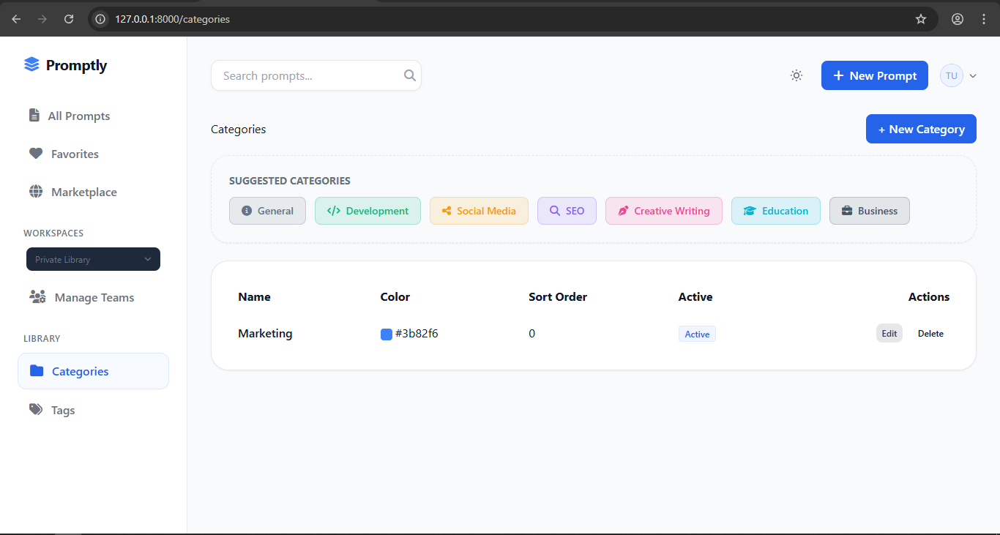
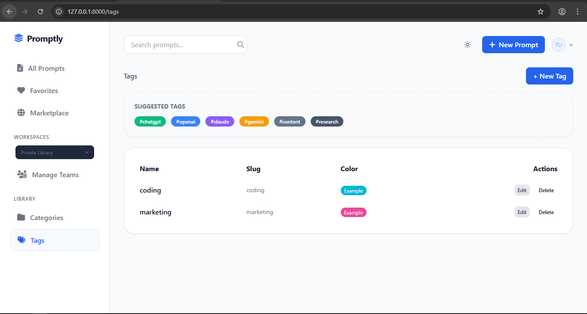
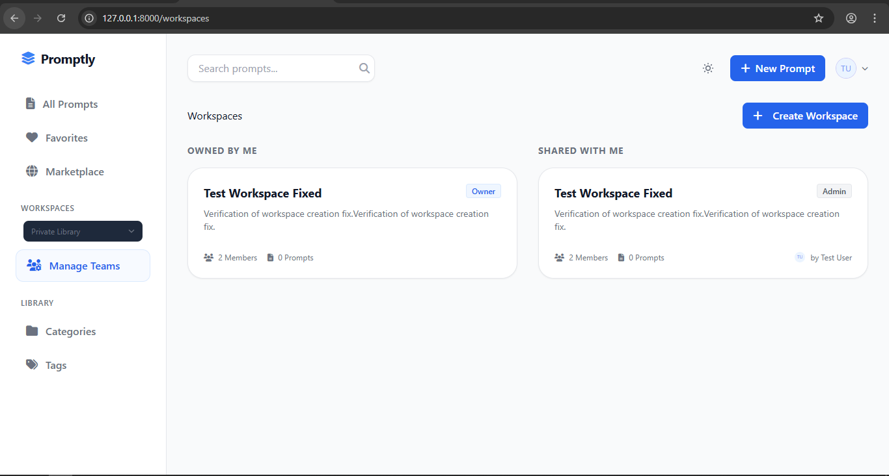
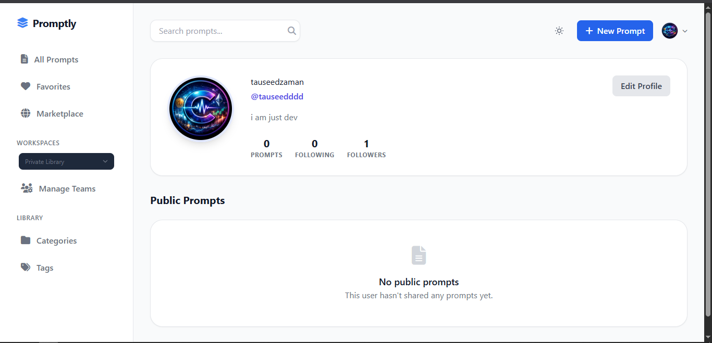
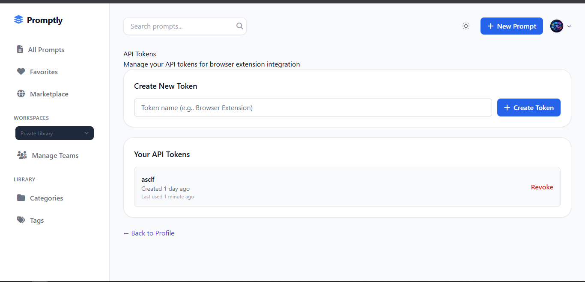
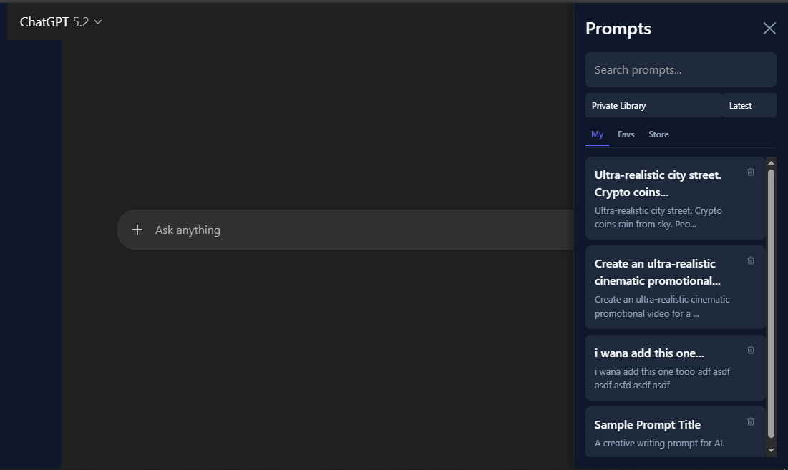
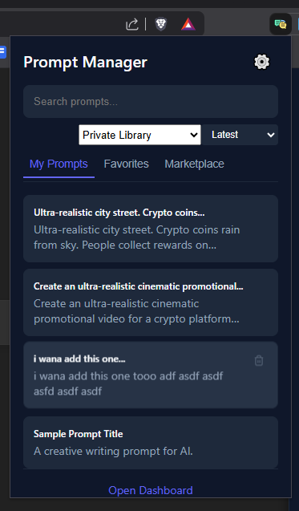

# 🚀 Prompts-Manager — AI Prompt Library Manager

A powerful open-source prompt management system to **store, organize, search, and reuse AI prompts**.

Built for developers, creators, marketers, and AI power users who constantly work with LLMs like ChatGPT, Claude, Gemini, and more.

Instead of rewriting prompts again and again — **save them once and reuse forever.**

---

## 📸 Screenshots

### 🏠 Home & Dashboard


### 📊 Quick-Add Categories & Tags




### 👥 Team Workspaces


### ⚙️ Settings & Profile



### 🧩 Chrome Extension in Action



---

## ✨ Features

### 📚 Prompt Management
- Create and store reusable prompts
- Categorize prompts with icons and colors
- Tag-based organization
- Favorites system
- Archive / restore prompts
- Duplicate prompts
- **Most Used Sorting**: Track and sort prompts by usage frequency.

### 👥 Team Workspaces (New! 🚀)
- Create shared workspaces for collaboration.
- Invite members with role-based access (Admin, Editor, Viewer).
- Shared prompt and category libraries.
- Context switching between private and team libraries.

### 🔎 Smart Search & Discovery
- Full-text search
- Filter by category, tags, language, tone
- **Marketplace**: Browse and import high-quality community prompts.

### ⭐ Productivity Tools
- One-click copy
- Prompt usage tracking (Most Used)
- Versioning support
- Import / Export JSON backups
- Extension support
- Markdown support

### 🧩 Chrome Extension (Active Development)
- Access your prompt library directly from ChatGPT and other sites.
- One-click injection into target textareas.
- Full workspace and search support.

---

## 🎯 Why Prompts-Manager?

AI workflows require consistent prompt engineering. Prompts-Manager helps you:

✅ Save time  
✅ Standardize prompts  
✅ Reuse templates  
✅ Organize prompt workflows  
✅ Build prompt libraries  
✅ Improve productivity  

Perfect for:

- AI developers
- Content creators
- Marketing teams
- Automation builders
- LLM power users

---

## 🏗️ Tech Stack

- Laravel 12
- MySQL / PostgreSQL
- Blade / Alpine.js
- REST API

---

## 🧠 Use Cases

- AI content generation workflows
- Social media prompt storage
- Team prompt sharing
- Automation pipelines

---

## 📦 Installation

### Requirements
- PHP 8.2+
- Composer
- Node.js
- MySQL / PostgreSQL

### Setup

```bash
git clone https://github.com/tauseedzaman/prompts-manager.git

cd prompts-manager

composer install
npm install

cp .env.example .env

php artisan key:generate
php artisan migrate --seed

npm run build
php artisan serve
```

### 🔐 Default Credentials
Once seeded, you can log in with:
- **Email:** `test@example.com`
- **Password:** `password`

---

## 🧩 Chrome Extension Setup

Access your prompts anywhere by installing the companion extension:

1.  Open Chrome and navigate to `chrome://extensions/`.
2.  Enable **Developer mode** (toggle in the top-right corner).
3.  Click **Load unpacked**.
4.  Select the `ext` folder from the root of this project.
5.  Click the extension icon in your browser and go to **Settings** (gear icon).
6.  Set your Backend API URL (e.g., `http://127.0.0.1:8000`) and your API Token (found in your Profile settings).

---

## 🗂️ Database Structure

Core entities:

* Categories
* Prompts
* Tags
* Workspaces (Owner, Members, Roles)
* Versions
* Ratings

---

## 🔌 API

* Create prompt
* Search prompts (with sorting)
* Workspace management
* Increment usage tracking

---

## 🛣️ Roadmap

* [x] Team collaboration
* [x] Browser extension (v1)
* [x] Marketplace for prompt packs
* [ ] AI prompt optimizer
* [ ] Telegram integration
* [ ] Cloud sync

---

## 🤝 Contributing

Contributions are welcome!

1. Fork the repository
2. Create a feature branch
3. Submit a pull request

---

## 📜 License

MIT License — free to use and modify.

---

## ⭐ Support

If you like this project, please give it a star.

---

## 👨‍💻 Author

Built with ❤️ by developer who use AI daily 🤗.